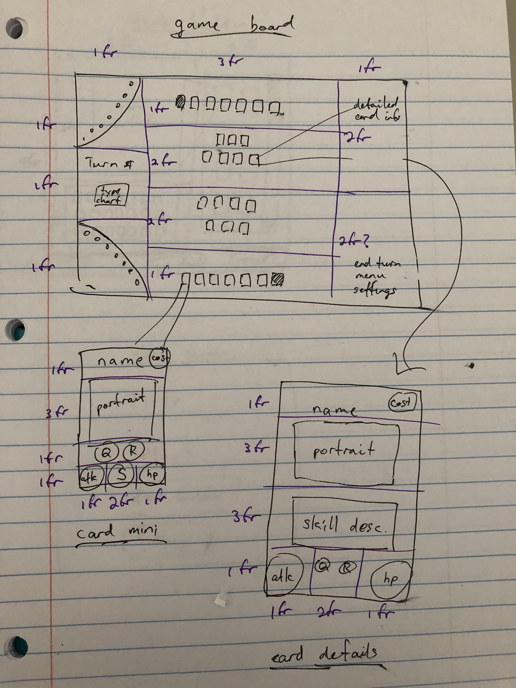
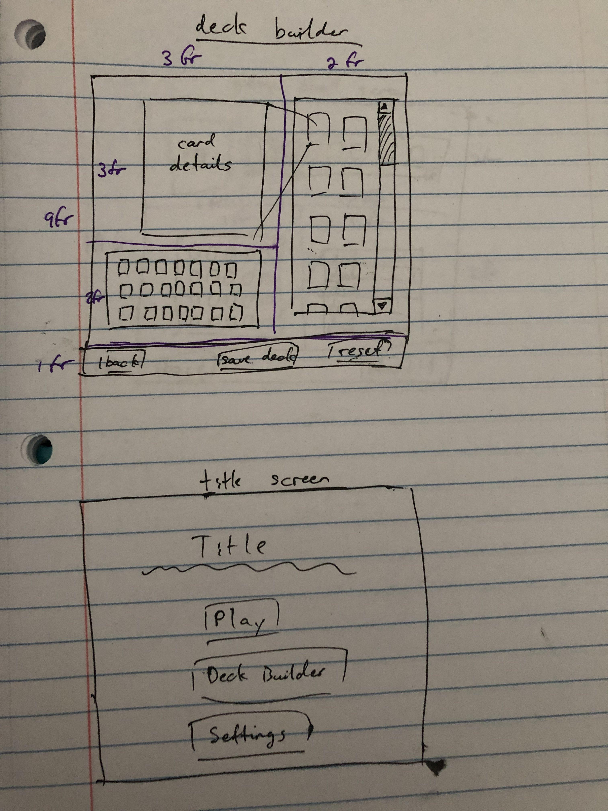
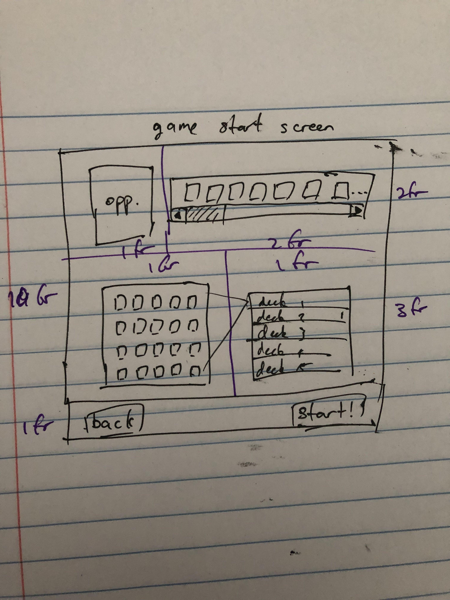

# Vantage Masters++
Vantage Masters is a collectible card minigame in the latter half of the Trails
of Cold Steel series of JRPGs. The card minigame is an homage to Vantage Master,
an earlier work by the same developer (which I have not actually played). I'm a
massive fan of the Trails universe (it's probably my favorite media ever) and
had a lot of fun playing Vantage Masters, so I figured I would try my hand at
re-creating it, at a baseline, and maybe even adding some cool new stuff to it
(hence the ++)!

## Rules
Fundamentally, players battle each other's Deck Masters using Natial cards. Each
player starts with their Master pre-placed in the Natial zone. The objective is
to kill the opposing Deck Master by reducing its health (green orb on the bottom
right) to zero. A player whose Master is killed will lose immediately.

Natials in the player's hand (back row) can be summoned to the Natial Zone if
the player can pay the mana cost (blue orb on the card's top right). The Natial
Zone has a front row and a back row. Natials in the back row cannot attack
unless they're Ranged (icon on the card's top left), but as long as there is
at least one Natial in the front row, they cannot be attacked either.

Immediately after summoning, Natials will usually have to wait until the next
turn before taking an action, unless the Natial is Quick (icon on the card's
top left). Otherwise, Natials can both move and attack every turn, but movement
must happen before attacking. To either move or attack, simply drag the Natial
to the appropriate space on the board. Natials can move onto other Natials,
which will cause them to swap places.

When Natials attack, they will deal damage equal to their Attack stat (red orb
on the card's bottom left) and, in some circumstances, be counterattacked for
1 less than the opponent's Attack stat. Damage is deducted directly from a
Natial's Health.

There are elemental advantages and disadvantages as well, which will grant a +2
damage boost or a -2 damage penalty respectively. Fire Natials beat Heaven
Natials beat Earth Natials beat Water Natials. Masters do not have an element.

Some Natials and Deck Masters have activated Skills, which can be used by 
right-clicking on them and then left-clicking the appropriate target. Deck
Master skills can be used as long as the Master can act, and have an associated
mana cost (blue orb on the card's top right). Natial skills do not require mana,
but can generally only be used once.

Other Natials and Masters even have passive abilities that trigger under
specific circumstances and do not need to be activated.

Finally, various Spells also exist to help you achieve victory. Spells are used
from the hand by dragging them to an appropriate target, and usually have a mana
cost as well.

## Technologies used
Everything was done in vanilla JS and CSS. I considered using Bootstrap to draw
the game board, but decided I wanted more fundamental experience with grid and
flexboxes. There are definitely things that may have been easier with jQuery,
but again, just to practice my JS fundamentals, I opted not to.

## Approach taken
Primarily, I wanted to practice my OOP approaches and just get some practice in.
I slowly rolled more features into each class and did several huge rounds of
refactoring to make the code look like it wasn't awful. I didn't manage to
finish refactoring everything into the classes that I wanted them to be in,
unfortunately.

The structure I ended up settling on involved hierarchical board elements: a
card is contained in a space on the board, which is contained in a specific zone
of the board, which is owned by the player. I've never created a complex
framework like this by myself before, so I really got the chance to appreciate
just *how freaking difficult* it is to create class architecture in a robust,
convenient, partitioned, and future-friendly way. It's a really fun challenge
though, definitely something I'm looking to keep practicing.

I did intend to break up the `structures.js` file so it wouldn't be absolutely
freaking enormous, but since I never finished refactoring I never actually got
around to that. Very sad.

## Installation instructions
Not applicable to this project.

## Unsolved problems
The only core feature I did not manage to get working was passive auras. The
logic behind the auras worked fine... until I realized that I forgot to actually
implement natial move swapping, and it was extremely hard to fit all of the
logic around that. All of that code is just commented out and those passives
simply do not work at the moment.

Someday, I'll get those stretch features implemented as well! A deck builder
would be fantastic, and an AI that can actually calculate its moves ahead of
time would be pretty nice too.

## User stories
### MVP goals
- Play the Vantage Masters card game against the computer.
    - This is a turn-based card game based on summoning monsters known as natials
    to the board to attack the opponent's deck master.
    - On each turn, players draw one card from their deck. Then, players can
    summon natials from their hand, move the natials around on their board, or
    attack with the natials on their board.
    - The natial zone has a front row and a back row.
    - Natials cannot take any action on the turn they're summoned, unless they
    have the "quick" flag.
    - The deck master is automatically placed on the back row of the natial zone
    at the start of the game, and generally behaves like a natial other than its
    role in determining victory/defeat.
    - Each player starts with an amount of mana specified by their deck master
    and automatically gains one maximum mana every turn.
    - Natial summoning is gated by mana.
    - Mana refills to the current maximum at the start of every turn.
    - The first player to move is random.
    - The first player to reduce the opposing deck master's HP to zero is the winner.
    - The computer opponent will summon natials to the board and attack with them.

### Gameplay goals
- Implement additional, more complicated gameplay mechanics.
    - Natials in the back row cannot attack, unless they have the "ranged" flag.
    Natials in the front row cannot attack natials in the opposing back row if
    there are natials in the opposing front row, unless the attacker has the
    "ranged" flag.
    - Some monsters will have special abilities, which can be activated at will,
    once per monster.
    - Some deck masters will have special abilities, which cost mana and can be
    used once per turn instead of one time only.
    - Add spells, which are activated directly from the hand and have a
    variety of effects. Spell usage costs mana.

### Stretch goals
- Play Vantage Masters with all of the cards and mechanics that exist in Trails
of Cold Steel IV.
- Play Vantage Masters against a smarter computer.
    - The computer will have some more sophisticated behavior, such as trying to
    maintain board control, saving spell cards for a "lethal", or focusing down
    the player's deck master exclusively.
- Build custom decks to play the game with.
    - The deck builder tool can be used to customize and craft decks with any
    combination of natials, spells, and masters.
    - Decks are composed of one deck master plus any twenty cards.
    - Each (non-master) card can be chosen at most three times.
    - Decks should be able to be named and saved locally for later retrieval.
- Choose from a variety of opponents to play the game against.
    - Opponents should feature decks of differing quality, strategy, and difficulty.

## Hypothetical workflow, roughly in order
1. Create a wireframe of the game board, a few debug cards, and a debug deck.
1. Implement (for the player) placing a natial on the board from the hand,
moving natials around friendly board zones, and attacking enemy natials.
1. Implement the framework for a turn. A turn starts with drawing one card from
the deck, then any combination of summoning, attacking, and movement. Turns end
when the "End Turn" button is clicked.
1. Implement a basic "AI" that simply summons as many cards as possible and attacks
with as many cards as possible on its turn.
1. Implement the back-and-forth between player turns and enemy turns, with the
first turn-taker being random.
1. Implement victory and loss conditions and a reset button.
1. Create a framework for spell card functionality via callbacks and create two
straightforward spells to debug with.
1. Create a framework for card active ability functionality via callbacks and
create two straightforward active effects to debug with.
1. Implement all the cards that exist in Trails of Cold Steel IV's Vantage
Masters II minigame.
1. Improve the aesthetics of every page to look like a game instead of a bunch
of wireframes.
1. **Everything up to this point has been completed.**
1. Create a wireframe of the deck builder, game start screen, and title screen.
1. Implement the deck builder, which lets the player choose cards to form their
deck with and save a list of decks in local storage for long term replayability.
1. Create a framework for having discrete opponents with discrete decks and
create two opponent decks to debug with.
1. Implement the game start screen, which allows players to choose their deck
and opponent.
1. Implement the title screen, which simply links to the deck builder and
the game start screen.
1. Any extras that I have time to finish will go here: more computer opponents,
more advanced AI scripts, a game tutorial, a "progress mode" where beating each
opponent for the first time unlocks a card for the deck, new cards and mechanics
of my own design, etc.

## Wireframes
MVP: board and card wireframes

Stretch: deck builder and title screen

Stretch: game start options
